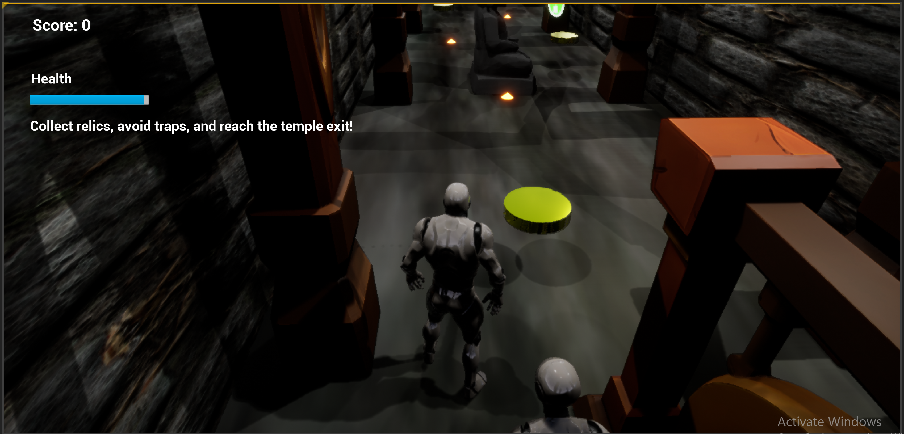

# Temple Escape – Unreal Engine Game

A third-person adventure game built independently using Unreal Engine, where the player navigates through a temple environment while avoiding AI temple guardian and obstacles to reach the goal.

---

## 🎮 Gameplay Features

- Third-person player movement and camera system  
- AI enemy (Temple Guardian) with patrol and chase behavior  
- Coin collection system with scoring  
- Health system and damage handling  
- Win/Lose conditions  
- Interactive environment with obstacles and triggers  
- Main menu with game start and settings  

---

## Project Type

**Personal Project**

---

##  What I Built

- Designed full gameplay logic using Unreal Engine Blueprints  
- Implemented AI behavior (patrol and chase system)  
- Built player interactions and collision detection  
- Developed scoring and health systems  
- Created win/lose game conditions  
- Designed level layout and environment  
- Implemented UI (HUD, score, health bar)  
- Debugged and optimized gameplay performance  

---

##  Tech Used

- Unreal Engine  
- Blueprint Visual Scripting  
- AI Behavior Trees  
- Level Design  

---

## 📁 Project Structure
---
TempleEscape/
├── Config/
├── Content/
├── Script/
├── screenshots/
│ └── gameplay.png
├── TempleEscape.uproject

---

---

## 📸 Screenshots

### Gameplay

---

## ▶️ How to Run

1. Open Unreal Engine  
2. Click **Open Project**  
3. Select `TempleEscape.uproject`  
4. Click **Play**  

---

##  Key Highlights

- Built as an independent project 
- Focused on gameplay mechanics and AI behavior  
- Demonstrates problem-solving and game logic design  

---

##  Author

**Nonyelum Maureen**  
Frontend & Mobile Developer  

GitHub: https://github.com/Nonye96

